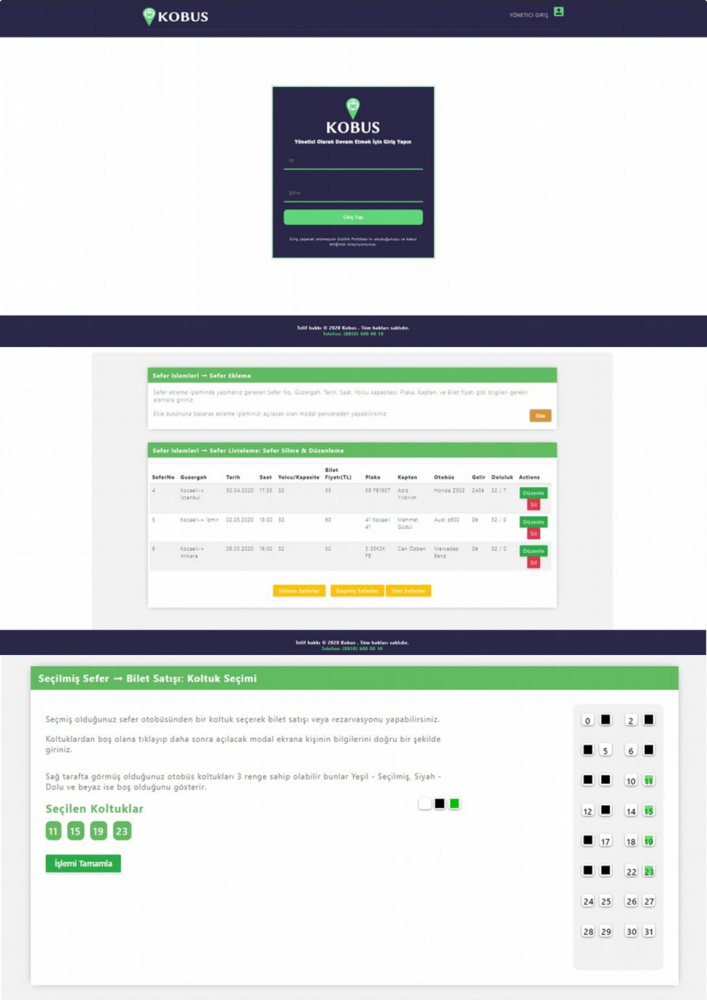

# KOBUS(Kocaeli Otobus)
KOBUS, Kocaeli merkezli bir firmanın bilet satış otomasyon programıdır. Proje 2 kişi ile geliştirilmiştir.
### Açıklama
Bağlı liste yapısı ile dosya işlemlerini kullanarak ASP.NET MVC (HTML,CSS,JS,C#) içerisinde geliştirildi.
Sefer işlemleri ile Bilet işlemlerinden oluşmaktadır.

